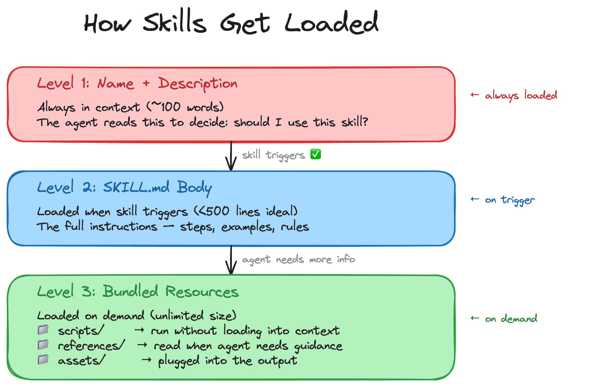

# Build Your First Agent Skill

Learn what agent skills are, how they work, and build one from scratch using your AI coding agent. This tutorial covers **GitHub Copilot** and **Claude Code**, but skills work across many agents. By the end, you'll have a working skill that transforms any repo's README into a polished, professional one.

**Time estimate:** 20-30 minutes

**Success check:** You can say "Good morning" in a new chat and the agent responds using your `good-morning` skill.

### What you'll build

We're going to build a skill called **README Wizard** that takes a basic README like this:

```
# My Project
Some setup instructions
npm install
npm run dev
```

And transforms it into something like this:


A polished README with a hero section, badges with live subscriber and member counts, quick start, project structure, Mermaid diagrams, documentation table, contributor avatars, social links, and a star history chart.

You can see the finished skill and example output in the [README Wizard repo](https://github.com/debs-obrien/readme-wizard) *(link coming soon)*.

---

## Table of Contents

- [Part 1: What Are Skills?](#part-1-what-are-skills)
- [Part 2: Anatomy of a Skill](#part-2-anatomy-of-a-skill)
- [Part 3: Build Your Own Skill](#part-3-build-your-own-skill)
- [Part 4: Share Your Skill](#part-4-share-your-skill)
- [Quick Reference](#quick-reference)

---

## Part 1: What Are Skills?

> 🎬 **Video 1: What Are Agent Skills?** (5-7 min) — [Watch on YouTube](#) *(link coming soon)*

### The problem

AI agents are smart. But they're generic. Your agent is trained on a ton of general knowledge, but it doesn't have your specific domain knowledge. It doesn't know your preferences, your team's conventions, or how you personally want things done.

When we learn a new skill — playing basketball, riding a bike — we're adding knowledge we didn't have before. Skills work the same way for your agent. You give it the domain knowledge it's missing, personalized to how you want things done.

### What is a skill?

A skill is a reusable set of instructions that teaches an AI agent how to do a specific task well. Think of it like a recipe card you hand to a talented chef. The chef knows how to cook, but they don't know your family's secret sauce. The recipe card tells them exactly what to do.

- **Without a skill** → the agent produces generic output
- **With a skill** → the agent follows your instructions and produces exactly what you want, every time

At its simplest, a skill is just **one file**: a `SKILL.md` with a name, description, and instructions. That's it. You can add extras like scripts, references, assets, and evals — but you don't have to. We'll cover those in [Part 2](#part-2-anatomy-of-a-skill). All you need right now is the `SKILL.md` file.

Let's build one.

### Build your first skill

Open VS Code in your project directory. We're going to create a `good-morning` skill step by step.

**Step 1: Create the folder structure**

Create a new folder in your project root. You can use `.agents/`, `.github/`, or `.claude/`. And then create a skills folder. The `.agents/skills/` path is the cross-agent convention that works with Copilot, Goose, and others however Claude code requires a `.claude/skills/` path. Inside the skills folder, create a folder called `good-morning`. This folder name is your skill's name.

```
your-project/
└── .github/
    └── skills/
        └── good-morning/
```

**Step 2: Create the SKILL.md file**

Inside the `good-morning` folder, create a file called `SKILL.md`. It must be in capital letters — that's how agents find it.

```
your-project/
└── .github/
    └── skills/
        └── good-morning/
            └── SKILL.md
```

**Step 3: Add the frontmatter**

Open `SKILL.md` and add the YAML frontmatter at the top:

```yaml
---
name: good-morning
description: A skill that responds to good morning with a cheerful greeting
---
```

Two important things here:

1. **The name must match the folder name.** If the folder is called `good-morning`, the name must be `good-morning`. If they don't match, the skill will not load.

2. **The name and description are always in context.** Every time you're working in this project, the agent sees the name and description so it knows what skills are available. Keep the description short and specific, this is how the agent knows when to use the skill.

**Step 4: Write the instructions**

Everything below the frontmatter is the skill body. This only gets added to context **when the skill is called**, not all the time. The agent only loads these instructions when it decides to use the skill.

Add the body below the frontmatter:

```markdown
---
name: good-morning
description: A skill that responds to good morning with a cheerful greeting
---

# Good Morning Skill

When the user says good morning, respond with:

- "Hi Debbie, hope you have a great day!"
- Ask if they have done any sport today
- Include a funny joke about sports

## Example

**User:** Good morning

**Agent:** Hi Debbie, have you done any sport today? Here's a funny joke about sports: Why did the soccer player bring string to the game? Because he wanted to tie the score!
```

That's the complete skill. One file. A few lines of instructions. Make it as personal as you like, put your own name in there, change the topic from sports to whatever you want.

### Test it

Start a **new chat session** (skills are discovered at session start) and type:

> Good morning

The agent finds the skill, reads the `SKILL.md` file, and responds.

**In GitHub Copilot**: *"Hi Debbie, have you done any sport today? Here's a funny joke about sports: Why did the bicycle fall over? Because it was too tired from all that cycling!"*

**In Claude Code**: First make sure to change the folder name from `.github` to `.claude` for your skill. Then open Claude Code from the same project directory, say "good morning", and you get the same thing: *"Hi Debbie, have you done any sport today? Here's a funny joke for you: Why do basketball players love donuts? Because they can always dunk them!"*

Skills work across agents. The same `SKILL.md` file works in Copilot, Claude Code, and others. Each agent discovers the skill, reads the instructions, and follows them.

### Troubleshooting (if it doesn't trigger)

- Start a **new chat session** after creating or moving skills
- Confirm the folder name matches the `name:` in frontmatter exactly
- Double-check the path for your agent (`.agents/skills/` vs `.claude/skills/`)

That's a skill in action. Now imagine instead of "good morning", the instructions told the agent how to generate a polished README, write commit messages in your team's format, or review code against your standards. Same idea, bigger impact.

### How skills get loaded

Skills are designed to be efficient with context windows. They use a three-level loading system. The agent only loads what it needs, when it needs it.



**Level 1** is always in the agent's context. It's just the name and description (~100 words). This is how the agent decides whether to use the skill. If someone says "improve my README", the agent scans its available skills and picks the one whose description matches.

**Level 2** loads when the skill triggers. The full SKILL.md body with all the instructions, steps, and examples. This is ideally under 500 lines.

**Level 3** loads on demand. Scripts, references, and assets that the agent pulls in only when it needs them. Scripts can even run without being loaded into context at all, saving tokens. And some resources might not load at all for certain projects. For example, a diagram template file only needs to be read if the project is complex enough to need an architecture diagram. Simple projects skip it entirely.

This matters because context windows are limited. A well-designed skill is lean at the top and detailed at the bottom.

### Where skills live

Skills can be installed at two levels:

- **Project-level**: in your project directory, available only when you're in that directory
- **Personal**: in your home directory, available from anywhere

Each agent checks slightly different locations:

**Quick pick:**
- Use `.agents/skills/` for GitHub Copilot in VS Code
- Use `.claude/skills/` for Claude Code

**GitHub Copilot (VS Code)**:
```
# Project-level (any of these work)
your-project/.github/skills/
your-project/.claude/skills/
your-project/.agents/skills/

# Personal (works from any directory)
~/.copilot/skills/
~/.claude/skills/
~/.agents/skills/
```

**Claude Code**:
```
# Project-level
your-project/.claude/skills/

# Personal (works from any directory)
~/.claude/skills/
```

The `.agents/skills/` path is part of the [Agent Skills open standard](https://agentskills.io) which is a cross-tool standard, but Claude Code uses its own `.claude/` directory structure, not `.agents/`.

### The skills ecosystem

There's a whole directory of skills at [skills.sh](https://skills.sh) where you can browse and discover skills built by the community.

To install a skill, use the skills CLI:

```bash
npx skills add anthropics/skills --skill skill-creator
```

This installs the `skill-creator` skill from Anthropic. A skill that helps you create other skills. One command and it's ready to use.

You can see what you have installed:

```bash
npx skills list
```

And search for skills:

```bash
npx skills find
```

Skills work across multiple AI agents — Copilot, Claude Code, Cursor, Goose, and many more. The skills CLI handles installing to the right location for each agent.

And that's just the beginning. The skills ecosystem is growing fast with new skills being added all the time. You can build your own skill and share it with the world, or just explore what's out there and install the ones that look useful. Have fun and start building some skills.
