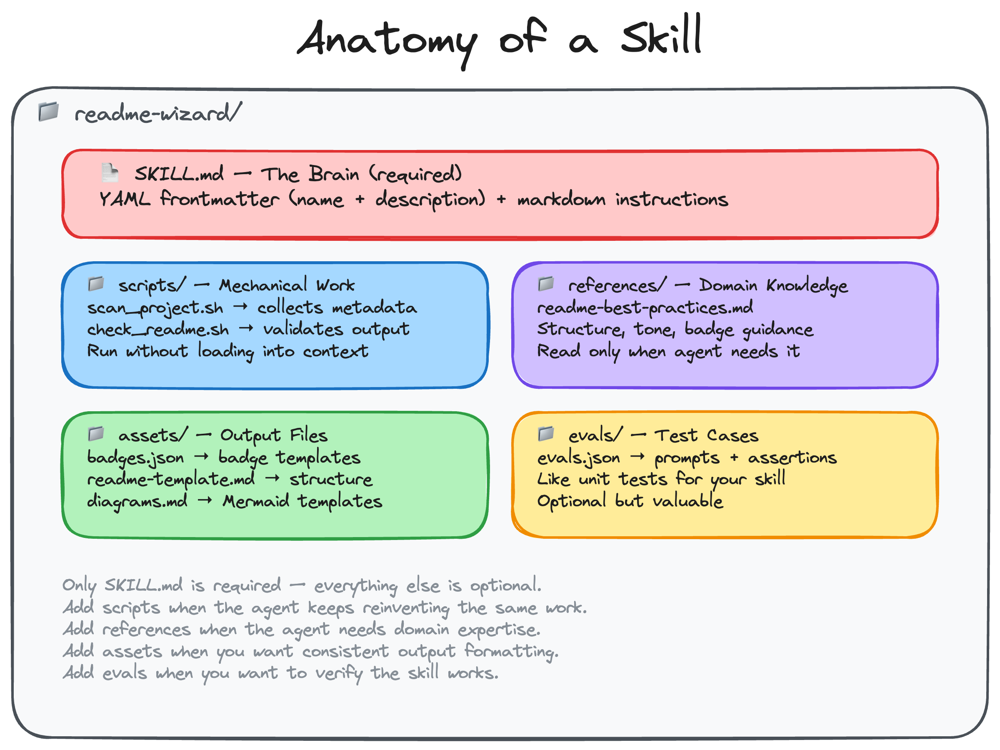
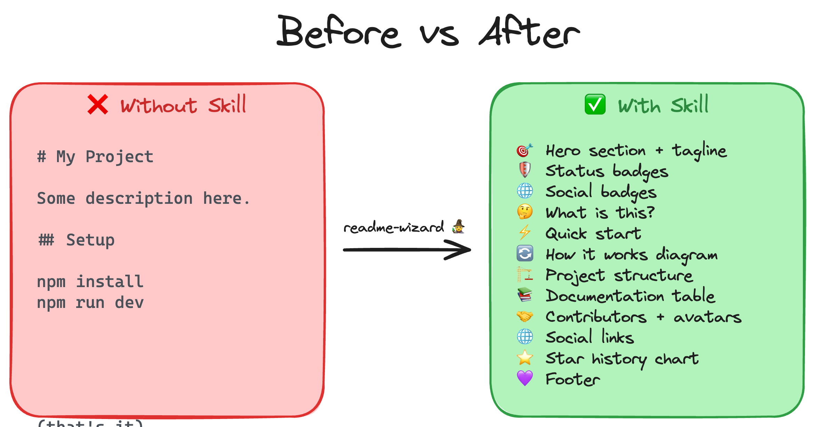

# Anatomy of a Skill

Now that you know what skills are, let's look inside one. We'll use a skill called **README Wizard** as our example. It transforms any repo's README into a polished, professional one.

**Success check:** You can explain what goes in `SKILL.md`, `scripts/`, `references/`, `assets/`, and `evals/`.

## The Folder Structure



Only `SKILL.md` is required. Everything else is optional. You add it when you need it.

## SKILL.md: The Brain

This is the only required file. It has two parts:

**1. YAML frontmatter**: the metadata at the top between `---` markers:

```yaml
---
name: readme-wizard
description: Generate a polished, professional README.md for any project...
---
```

The `name` identifies the skill. The `description` is the most important part. It's what the agent reads to decide whether to use this skill. Make it specific about what the skill does AND when to use it.

A good description is "pushy". It tells the agent to use the skill even when the user doesn't explicitly ask for it:

> *"Generate a polished, professional README.md for any project. Use this skill whenever the user mentions README, wants to improve their repo's first impression, asks about badges, or wants their GitHub repo to look more professional, even if they don't explicitly say 'README'."*

**2. Markdown body**: the instructions the agent follows:

This is where you tell the agent what to do, step by step. For our README Wizard, the body walks through: scanning the project, reading best practices, picking badges, filling in a template, and personalizing the output.

The body should be under 500 lines. If you need more detail, put it in reference files.

## Scripts

Scripts handle deterministic, repeatable tasks that the agent would otherwise reinvent every time. For our README Wizard:

- **`scan_project.sh`**. Scans a project directory and outputs JSON with the project name, description, license, git remote, social links, directory structure, package manager, and CI configuration. It searches in three layers: local files → GitHub API → homepage crawl.

- **`check_readme.sh`**. Validates a generated README has all the expected sections (headings, badges, code blocks, etc.) and outputs a pass/fail report.

The key insight: **scripts run without being loaded into the agent's context**. The agent executes them and reads the output. This saves tokens. A 200-line bash script doesn't eat into the context window.

## References

References are documents the agent reads when it needs guidance. For our README Wizard:

- **`readme-best-practices.md`**. Covers what makes a great README, recommended section order, writing tone, badge best practices, and common mistakes.

The agent only reads this when it's about to write a README. It doesn't load it upfront. This is progressive disclosure. Keep the main instructions lean, and put the deep knowledge in reference files.

For large reference files (over 300 lines), include a table of contents at the top so the agent can find what it needs quickly.

## Assets

Assets are files that get plugged into the output. For our README Wizard:

- **`badges.json`**. A catalog of badge templates with `{{PLACEHOLDER}}` markers. Includes status badges (license, version, CI), social badges (YouTube with subscriber count, Discord with member count, Twitter, LinkedIn), and extras (star history, contributor avatars).

- **`readme-template.md`**. The README structure with `{{PLACEHOLDER}}` markers for all dynamic content. The agent fills in the placeholders with real project data.

- **`diagrams.md`**. Mermaid diagram templates for common project types (content sites, APIs, CLI tools, monorepos).

Assets are different from references. References teach the agent, assets are used in the output.

## Evals

Evals are test cases that define what "good" looks like. For our README Wizard:

- **`evals.json`**. Contains test prompts and assertions. Each test case has a realistic prompt (like "generate a README for this project") and a list of things the output should contain (badges, quick start section, contributing section, etc.).

Evals are optional but valuable. They're like unit tests for your skill. You can validate the output by running the check script:

```bash
bash scripts/check_readme.sh /path/to/generated/README.md
```

```
🧙 README Wizard: Validation Report
  File: README.md
  ────────────────────────────────────

  Structure
  ✅ Has a top-level heading
  ✅ Has a project description
  ✅ Has a Quick Start section
  ✅ Contains code blocks
  ✅ Has a project structure section
  ✅ Has a documentation section
  ✅ Has a contributing section

  Badges
  ✅ Has 2+ shields.io badges (7 found)
  ✅ Uses for-the-badge style
  ✅ Has social link badges

  Extras
  ✅ Has star history chart
  ✅ Has a footer with license info
  ✅ Has contributor avatars

  ────────────────────────────────────
  Results: 13 passed, 0 failed
```

## Before vs After

Here's what the README Wizard actually produces. The difference between a README without the skill and with it:



Now you know what a skill looks like and what each piece does. In Part 3, you'll build this exact structure from scratch and experience firsthand why each folder exists.

## Next Steps

You've seen the anatomy of a skill. Now let's build one from scratch.

**Next:** [Tutorial 3: Build the README Wizard — Phase 1 →](03_build-readme-wizard-skill-part_1.md)