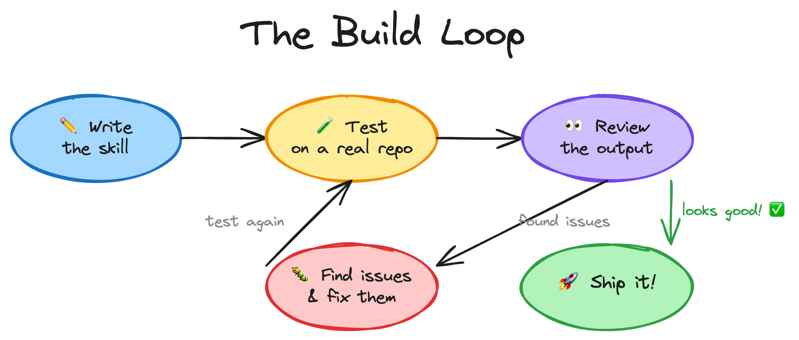

# Build Your Own Skill - a Readme Wizard

Time to build the README Wizard from scratch. We'll start simple, get something working, then improve it step by step. Along the way you'll see exactly why skills have the folder structure they do.

**Success check:** Run the skill on a test project and confirm the README now has shields.io badges, a Quick Start section, and a project structure tree.

---

### Prerequisites Checklist

Before you start, make sure you have:

- ✅ Tutorial 1 completed (you built the `good-morning` skill)
- ✅ Tutorial 2 read (you understand the skill folder structure)
- ✅ VS Code or your editor open with your project
- ✅ Your agent (GitHub Copilot, Claude Code, or Cursor) ready to chat
- ✅ A test project ready (use your own repo, or clone any public repo to test on)

---

### 💡 Quick Reminder

Each step has **"Copy this prompt"** sections. Just copy the text, paste it into your agent's chat, and let the agent do the work. If you're using Claude Code, remember to swap `.agents/` to `.claude/` in the prompts.

---

## The Build Loop

This is the process we'll follow throughout:



Write the skill → test it on a real repo → review the output → find issues and fix them → test again. Repeat until it's good. Then ship it.

## Setup

Before we start, make sure you have:

1. **Node.js** installed (for the skills CLI)
2. **GitHub Copilot** (with Copilot Chat in VS Code) or **Claude Code** installed
3. **A project to test against**. Use your own repo, or clone any public repo


## Phase 1: Get Something Working

### Step 1: Create the skill folder

We need a folder for our skill with a SKILL.md file inside it. Just like in Tutorial 1, skills live inside a `skills/` directory. We'll use `.agents/skills/` which is the cross-agent convention that works with Copilot, Goose, and others.

Copy this prompt:

```
Create a new skill folder at .agents/skills/readme-wizard/ with an empty SKILL.md file inside it.
```

> **Claude Code users:** Use `.claude/skills/readme-wizard/` instead.

You should end up with:

```
.agents/
└── skills/
    └── readme-wizard/
        └── SKILL.md
```

Open the SKILL.md. It's empty for now. We're going to fill it with our own instructions.

### Step 2: Write a basic SKILL.md

Let's start simple. We want a skill that improves a project's README by adding badges, a quick start section, project structure, and social links. We'll put everything in one file for now.

Copy this prompt:

```
Replace the contents of .agents/skills/readme-wizard/SKILL.md with a skill that generates or improves project READMEs. The frontmatter should have name: readme-wizard and a description that tells the agent to use this skill whenever someone mentions README, wants to improve their repo's first impression, asks about shields.io badges, star history charts, contributor avatars, documentation tables, project structure trees, or mermaid architecture diagrams — even if they never say the word "README".

The body should tell the agent to:
1. Detect the project name, description, license, git remote, package manager (npm, yarn, pnpm, pip, cargo, go, etc.), and CI setup by reading the project files
2. Improve the README to include: a centered hero section with the project name and tagline, shields.io badges (license, version, CI, stars) using style=for-the-badge, a "What is this?" section, a Quick Start section with real install/run commands, a project structure tree, a documentation table, a contributing section with contributor avatars from contrib.rocks, social link badges (only if social links exist), and a footer with a star history chart
```

The agent writes a SKILL.md with all the instructions inline. Open it and take a look. It should be around 30-50 lines of clear, step-by-step instructions.

### Step 3: Test it

Let's see if our basic skill works. We'll test it right here in this project — the skill is already in place.

**Start a new chat session** (agents load skills at session start), then copy this prompt:

```
Improve the README for this project following the readme-wizard skill instructions.
```

The agent scans the project and improves the README based on the instructions we wrote. Take a look at the output. It probably works, but you'll notice some issues:

- The badges might be inconsistent or use different styles
- The structure might vary each time you run it
- The agent might have guessed at social links that don't exist
- Some projects won't have CI, releases, or social links — the agent might add badges for things that don't exist, or skip sections without explanation
- It wrote the scanning logic from scratch instead of reusing anything

That's OK. We have a working starting point. Now let's make it better.

## Quick Win Checkpoint

If you only need a simple skill, you can stop here.
 You already have a working `SKILL.md` that improves READMEs and a clear prompt you can reuse. Everything after this point is about making the skill more consistent and maintainable.

## Troubleshooting

- Verify the skill is in the project you are testing
- Start a new chat session so the agent re-discovers the skill
- Check the frontmatter `name:` matches the folder name exactly

## Next Steps

You have a working skill. Now let's make the output more consistent.

**Next:** [Tutorial 4: Build the README Wizard — Phase 2 →](04_build-readme-wizard-skill-part_2.md)
