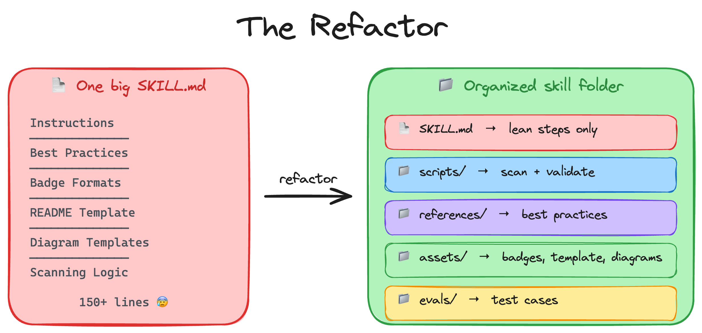

# Phase 2: Add More Detail

**Success check:** Run the skill twice on the same project. Both outputs should have the same section order, badge style (`style=for-the-badge`), and tone.

### Prerequisites Checklist for Phase 2

Before you start, verify you have:

- ✅ Tutorial 3 completed (`.agents/skills/readme-wizard/SKILL.md` exists and works)
- ✅ Basic skill tested successfully (you generated a README once)
- ✅ Agent ready in a new chat session

> Steps continue from Tutorial 3. We pick up at Step 4.

---

### Step 4: Flesh out the SKILL.md

The basic skill works but the output is inconsistent. Let's add more detail to the instructions: specific badge formats, best practices for writing tone, project-type adaptation, common pitfalls to avoid, a template for the README structure, and clearer rules.

Copy this prompt:

```
Update the readme-wizard SKILL.md to include more detail. Add a "Best Practices" section with guidance on README structure, section order, writing tone with good vs bad examples, and a note that not every project needs every section. Add an "Adapting to Project Type" section covering libraries/frameworks, web apps, documentation repos, small utilities, and monorepos. Add a "Badge Guide" with the exact shields.io URL formats for status badges (license, version, CI, stars) and social badges (YouTube with subscriber count, Discord with member count, Twitter, LinkedIn, Bluesky, Twitch) all using style=for-the-badge with a note that 3-5 status badges is the sweet spot. Add a "README Structure" section listing the exact sections in order with a description of what each one contains. Add a "Common Pitfalls" section covering issues like placeholder text left in, fabricated badges, outdated install commands, generic descriptions, overly long READMEs for simple projects, and missing Quick Start sections. Add a "Mermaid Diagrams" section with templates for common project types.
```

The agent updates the SKILL.md with all this detail. Open it and look at the file size. It's probably 150+ lines now. All the badge formats, best practices, structure guide, and diagram templates are inline.

### Step 5: Test again

Let's test the improved version.

Copy this prompt:

```
Improve the README for this project following the readme-wizard skill instructions.
```

Much better! The badges are consistent, the structure follows the template, the tone is right. But look at the SKILL.md file. It's getting long and hard to maintain. The badge templates, best practices, project-type guidance, common pitfalls, README structure, and diagram templates are all mixed in with the instructions. If you want to update a badge format, you're scrolling through 150+ lines. If someone wants to customize just the template, they have to edit the whole file.

## Troubleshooting

- Re-run the prompt in a new chat session so the skill loads fresh
- Confirm the badge URLs use `style=for-the-badge`
- Make sure your SKILL.md includes explicit section order and tone guidance

This is the problem that skill folders solve. By breaking the file into separate pieces:

- **Maintainability**: easier to find and update a specific piece (like a badge format) without scrolling through everything
- **Readability**: the SKILL.md stays focused on the steps, not buried in data
- **Customizability**: someone can swap out just the badges or the template without touching the instructions
- **Scripts save tokens**: a scan script runs without loading into the agent's context at all
- **Selective loading**: some files only need to load for certain projects (like diagram templates for complex projects)

Let's refactor.



## Next Steps

The skill works but the file is bloated. Let's break it into the proper folder structure.

**Next:** [Tutorial 5: Build the README Wizard — Phase 3 →](05_build-readme-wizard-skill-part_3.md)

